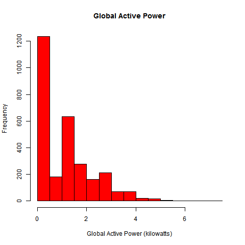
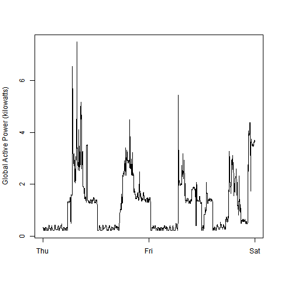
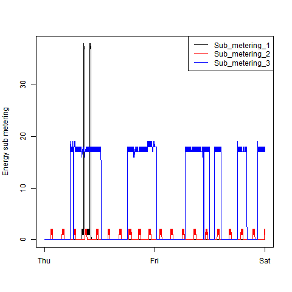
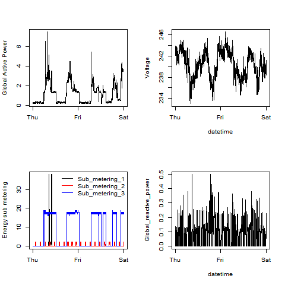

## Introduction
The R scripts in this directory will generate the graphs as needed for the 
exploratory data analysis first project. 
The directory contains four source files as well as the expected outputs,
in the form of 480x480 px PNG files

## Instructions
Each of the R files will independently generate a corresponding plot.
The script requires that the uncompressed datatet, 
household_power_consumption.txt, is placed in the working directory

The scripts will read the data, drop all unneeded rows, convert the data and 
time columns to a single native POSIX time-date column. All plots with time
will subsequently use this time-date column only.

A PNG device shall be opened, and all plots generated.

## Plots
The plots generated

###Plot 1

###Plot 2

###Plot 3

###Plot 4

